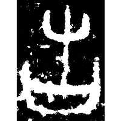
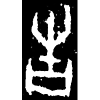
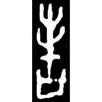
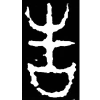
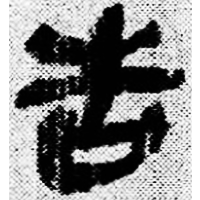
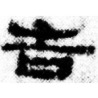
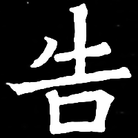

+++
radical = "30"
weight = 1
+++

#### 告¹

| Shang (Shi) | Shang (Bin) | Shang (He) | Middle W.Zhou | Qin | W.Han | E.Han | Nanbei (E.Wei) |
| ----- | ----- | ----- | ----- | ----- | ----- | ----- | ----- |
|  |  |  |  |  |  |  |  |
| 合20577 | 合891正 | 合補8726 | 集4293 | 睡.日乙194 | 武.甲服8 | 曹全碑 | 南0466X |

{告} \*kˤuks "to report"

Shortened [壴](https://panatesu.github.io/glyph-origins/radicals/33/#U%2b58F4) *DRUM* + differentiative element 口.

- 陳美蘭 2013 - 說“告”

#### 告²

?{造} \*(mə.)tsʰˤus "to go to"

♪[屮](https://panatesu.github.io/glyph-origins/radicals/45/#U%2b5C6E) \*TSU + differentiative element 口.

- 陳劍 2006 - 釋造
