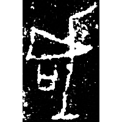
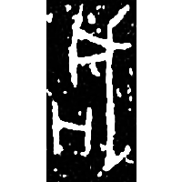
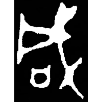
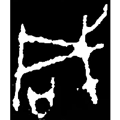
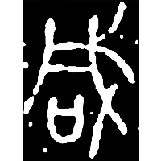
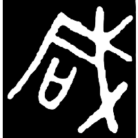
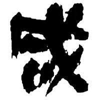
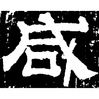
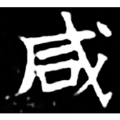
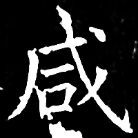

+++
radical = "30"
weight = 1
+++

| Shang (Shi) | Shang (Li) | Early W.Zhou | Middle W.Zhou | Chunqiu (Qin) | Zhanguo (Qin) | Qin | E.Han | Nanbei (N.Wei) | Tang |
| ----- | ----- | ----- | ----- | ----- | ----- | ----- | ----- | ----- | ----- |
|  |  |  |  |  |  |  |  |  |  |
| 合19957正 | 屯3898 | 集2763.1 | 集6516 | 集證59 | 集11394 | 嶽一.質7 | 張君碑 | 南0420A | 開石.禮記32 |

{咸} \*\[ɡ\]ˤr\[ə\]mʔ "to kill" ♪→ {咸} \*\[ɡ\]ˤr\[ə\]m "all"

[戌](https://panatesu.github.io/glyph-origins/radicals/62/#U%2b620C) *BATTLE AXE* + differentiative element 口.

- 林志強 & al. (ed.) 2017 - 《文源》評注 (421)
