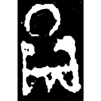
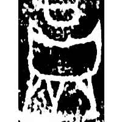
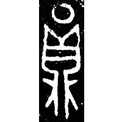
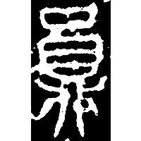
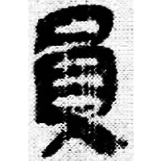
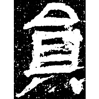
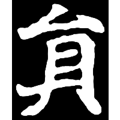
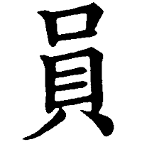

+++
radical = "30"
weight = 1
+++

| Shang (Shi) | Shang (Bin) | Early W.Zhou | Chunqiu (Qin) | Qin | E.Han | Nanbei (N.Wei) | Tang |
| ----- | ----- | ----- | ----- | ----- | ----- | ----- | ----- |
|  |  |  |  |  |  |  |  |
| 合20592 | 合10978 | 集5861 | 石鼓.車工 | 睡.爲29 | 尚博殘碑 | 憻賓墓誌 | 九經字樣 |

{圓} \*\[w\]ran "round" ♪→ {員} \*\[w\]ran "member"

[鼎](https://panatesu.github.io/glyph-origins/radicals/206/#U%2b9F0E) *CAULDRON* (because of its roundness) (\> 貝) + ♪[〇](https://panatesu.github.io/glyph-origins/radicals/215/#U%2b3007)² \*\[W\]AN.

- 裘錫圭 2013 - 文字學概要 \[2nd ed.\] \[2021 form.\] (157)
