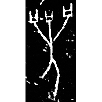
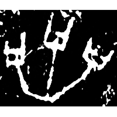
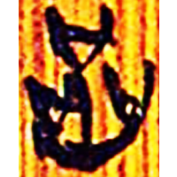
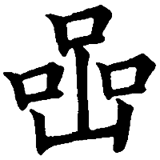

+++
radical = "30"
weight = 1
+++

| Shang (Bin) | Shang (Bin) | Zhanguo (Chu) | Tang |
| ----- | ----- | ----- | ----- |
|  |  |  |  |
| 合17599反 | 合5574 | 清二.繫年138 | 九經字樣 |

{喦/讘} \*nep "talkative"

Depiction of a person ([人](https://panatesu.github.io/glyph-origins/radicals/9/#U%2b4EBA)) with three mouths ([口](https://panatesu.github.io/glyph-origins/radicals/30/#U%2b53E3)). Later shortened to the upper part.

- 裘錫圭 1989 - 說“喦”“嚴”
