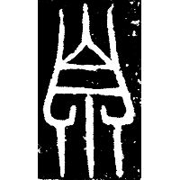
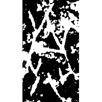
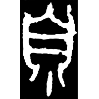
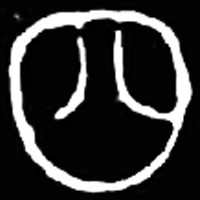
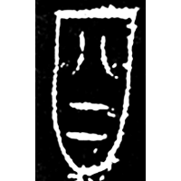
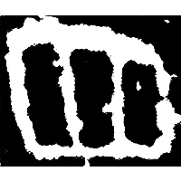
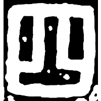
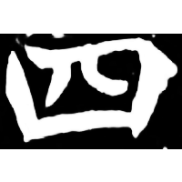

+++
radical = "31"
weight = 1
+++

| Shang | Shang (Bin) | Early W.Zhou | Chunqiu (Jin) | Chunqiu (Chu) | Zhanguo (Jin) | Zhanguo (Qin) | Qin | E.Han | Nanbei (N.Wei) |
| ----- | ----- | ----- | ----- | ----- | ----- | ----- | ----- | ----- | ----- |
|  |  |  |  |  |  |  |  |  |  |
| 集1225 | 合2354臼 | 集3862 | 集236 | 新收519 | 集2609 | 秦陶1610 | 集證143.168 | 乙瑛碑 | 南0091X |

{呬} \*C̥.lri\[j\]s "breath" or {泗} \*sV.li\[j\]s "nasal mucus" ♪→ {四} \*sV.li\[j\]s "four"

Depiction of a nose ([自](https://panatesu.github.io/glyph-origins/radicals/132/#U%2b81EA)) with air or nasal mucus coming out of it.

- 劉洪濤 2018 - 釋“四”
- 劉洪濤 2019 - 形體特點對古文字考釋重要性研究 (173-183)
- 季旭昇 2014 - 說文新證 \[2nd ed.\] (948)
