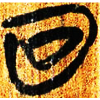
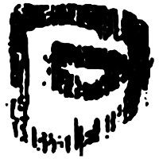
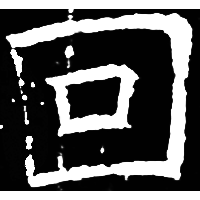

+++
radical = "31"
weight = 1
+++

| Zhanguo (Chu) | Qin | Han | Nanbei (N.Qi) |
| ----- | ----- | ----- | ----- |
|  |  |  |  |
| 上七.君乙1 | 北.從軍 | 舉21.1.41 | 竇泰墓誌 |

{圍} \*\[w\]əj "to encircle" ♪→ {回} \*\[w\]ˤəj "to turn round"

Depiction of an encircled circle.

- 鄔可晶 2019 - 說“回”
