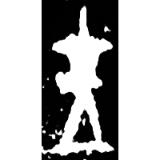
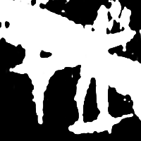
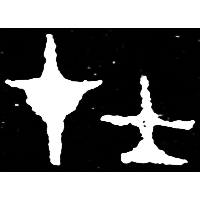
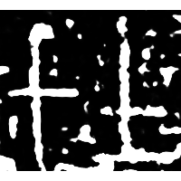
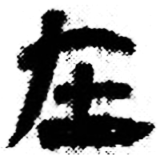
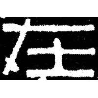
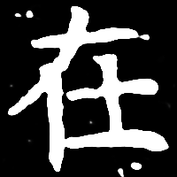

+++
radical = "32"
weight = 1
+++

| Shang (Bin) | Shang (Chu) | Early W.Zhou | Late W.Zhou | Qin | Han | E.Han | Nanbei (E.Wei) |
| ----- | ----- | ----- | ----- | ----- | ----- | ----- | ----- |
|  |  |  |  |  |  |  |  |
| 合371反 | 英1989 | 集5983 | 近出43 | 睡.爲13 | 虛3551 | 漢0097X | 元湛墓誌 |

{在} \*\[dz\]ˤəʔ "to exist"

♪[才](https://panatesu.github.io/glyph-origins/radicals/64/#U%2b624D) \*TSƏ + ♪[士](https://panatesu.github.io/glyph-origins/radicals/33/#U%2b58EB) \*TSƏ.

- 劉釗 2011 - 古文字構形學 \[2nd ed.\] (83-84)
- 季旭昇 2014 - 說文新證 \[2nd ed.\] (908)
