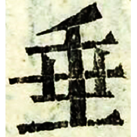

+++
radical = "32"
weight = 1
+++

| Nanbei (N.Wei) | Nanbei (N.Wei) | Tang | Ming |
| ----- | ----- | ----- | ----- | ----- | ----- | ----- | ----- |
|  |  |  |  |
| 慈慶墓誌 [𡸁] | 鄭黑墓誌 | 五經文字 | 字彙 |

{陲} \*\[d\]o\[j\] "frontier" ♪→ {垂} \*\[d\]o\[j\] "to hang down"

♪[𡸁](https://panatesu.github.io/glyph-origins/radicals/46/#U%2b21E01) \*TOJ with the lower part replaced with [土](https://panatesu.github.io/glyph-origins/radicals/32/#U%2b571F) *EARTH*. 

- 李學勤 (ed.) 2012 - 字源 (1195)
