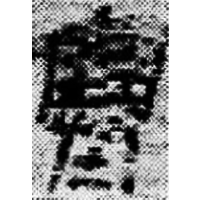
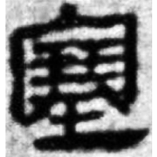
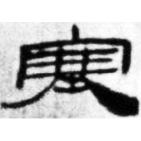
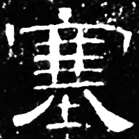
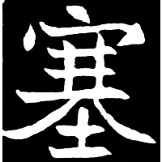

+++
radical = "32"
weight = 1
+++

| Qin | W.Han | Han | E.Han | Nanbei (N.Wei) |
| ----- | ----- | ----- | ----- | ----- |
|  |  |  |  |  |
| 里耶8-461正 | 馬.相56 | 居舊239.36 | 曹全碑 | 李媛墓誌 |

{塞} \*\[s\]ˤək "to block up" or {塞} \*\[s\]ˤəks "fortress"

[土](https://panatesu.github.io/glyph-origins/radicals/32/#U%2b571F) *EARTH* + ♪[𡫳](https://panatesu.github.io/glyph-origins/radicals/40/#U%2b21AF3) \*SƏK.

- 于省吾 1979 - 甲骨文字釋林・釋𡫳
