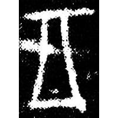
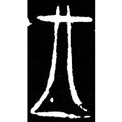
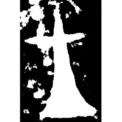
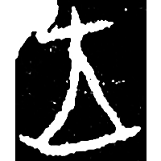
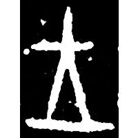
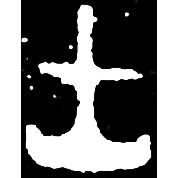
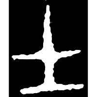
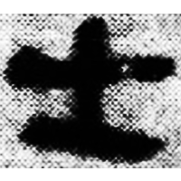
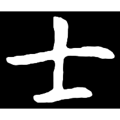

+++
radical = "33"
weight = 1
+++

| Shang (Shi) | Shang (Shi) | Shang (Shi) | Shang (Shi) | Shang (Shi-Bin) | Early W.Zhou | Early W.Zhou | Qin | E.Han | Nanbei (N.Wei) |
| ----- | ----- | ----- | ----- | ----- | ----- | ----- | ----- | ----- | ----- |
|  |  |  |  |  |  |  |  |  |  |
| 合21405 | 合19946反 | 合21471反 | 合22327 | 合15496 | 集5421.2 | 集2314 | 睡.日甲5背 | 楊震碑 | 元愔墓誌 |

{士} \*\[dz\]rəʔ "knight" & {王} \*\[w\]aŋ "king"

Depiction of a downward-facing axe blade as a symbol of power. Initially it was used for both words {王} and {士}. Later it began to be used only for {士}.

- 林澐 1965 - 說王
- 季旭昇 2014 - 說文新證 \[2nd ed.\] (59-50)
