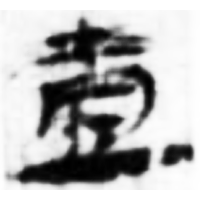
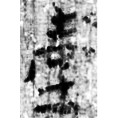
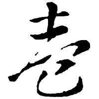
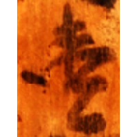
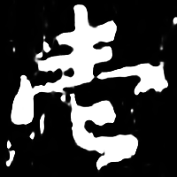
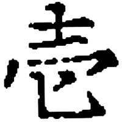

+++
radical = "33"
weight = 1
+++

| Han | Han | W.Jin | Nara | Yuan | Meiji |
| ----- | ----- | ----- | ----- | ----- | ----- |
|  |  |  |  |  |  |
| 武醫25 | 居舊265.2 | 索靖 | 平1-212 | 元0137X | 地主名鑑 |

Shortening of  based on the cursive form. Modern simplified form of  in Japan.

- Bökset R. 2021 - Long Story of Short Forms: Simplified Chinese Characters from A to Z (339)
