+++
radical = "33"
weight = 1
+++

| Shang (Bin) | Middle W.Zhou | Zhanguo (Qi) | Zhanguo (Qin) | Zhanguo (Qin) | Qin | Qin | W.Han | W.Han | E.Han | E.Han | Tang |
| ----- | ----- | ----- | ----- | ----- | ----- | ----- | ----- | ----- | ----- | ----- | ----- |
| 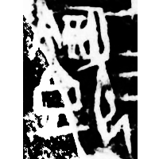 | 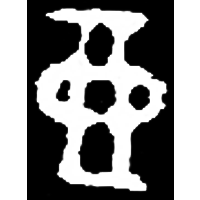 | 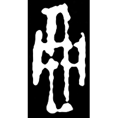 |  | 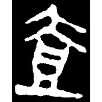 | 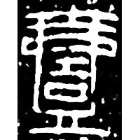 | 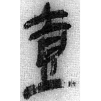 | 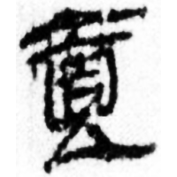 | 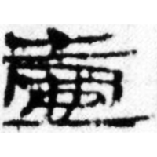 | 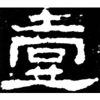 | 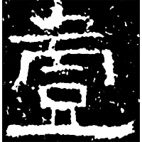 | 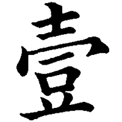 |
| 合5411+合補6191正 [⿰食㱅] | 集10175 [懿] | 集3939 [懿] | 陶錄6.56 | 駰乙.背 | 秦銘147 | 北.算丙 | 銀二1743 | 武.士相見9 | 史晨奏銘 | 白石神君碑 | 五經文字 |

{噎} \*qˤi\[k\] "to choke" ♪→ {一/壹} \*ʔit "one"

Shortened form of [㱅](https://panatesu.github.io/glyph-origins/radicals/76/#U%2b3C45) (depiction of a person with something stuck in his mouth for {噎}). Later ♪[吉](https://panatesu.github.io/glyph-origins/radicals/30/#U%2b5409) \*KIT was added.

- 蔣玉斌 2013 - 甲骨綴合所得新字新形研究

**Forms:**

[壱](https://panatesu.github.io/glyph-origins/radicals/33/#U%2b58F1) - Shortening based on the cursive form. Modern simplified form in Japan.

  
