+++
radical = "35"
weight = 1
+++

| Shang (Li) | Late W.Zhou | Late W.Zhou | Chunqiu (Qin) | Qin | W.Han | W.Han | W.Han | E.Han | Nanbei (E.Wei) | Tang |
| ----- | ----- | ----- | ----- | ----- | ----- | ----- | ----- | ----- | ----- | ----- |
| 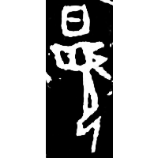 | 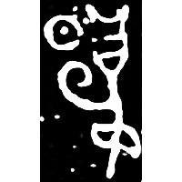 | 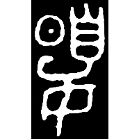 | 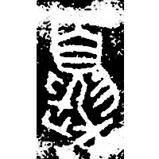 | 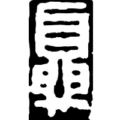 | 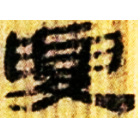 | 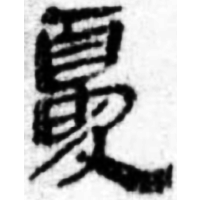 | 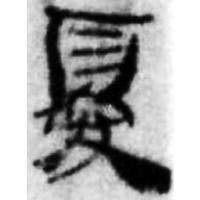 | 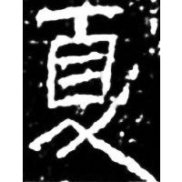 | 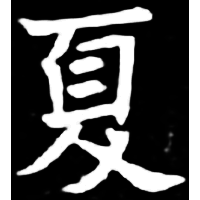 | 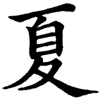 |
| 合27722 | 集2584 | 集719 | 集4315 | 秦印編98 | 北.淫Z1 | 銀二1623 | 孔.日書472 | 刑徒墓地312 | 元湛墓誌 | 五經文字 |

{夏} \*\[g\]ˤraʔ "summer"

Depiction of the sun () shining above a person (). Later decorative 𦥑 and 夊 were added, and then  and 𦥑 were shortened.

- 劉釗 2011 - 古文字構形學 [2nd ed.] (283-285)
