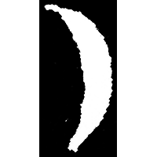
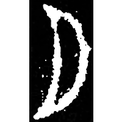
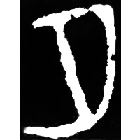
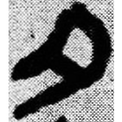
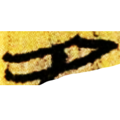
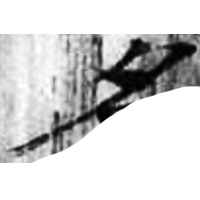
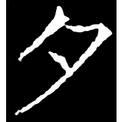

+++
radical = "36"
weight = 1
+++

| Shang | Shang (Shi) | Shang (Wuming) | Middle W.Zhou | Chunqiu (Qin) | Qin | W.Han | E.Han | Nanbei (N.Wei) | Tang |
| ----- | ----- | ----- | ----- | ----- | ----- | ----- | ----- | ----- | ----- |
|  |  |  |  |  |  |  |  |  |  |
| 集7702 [名] | 合19798 | 合27271 | 集4170.1 | 集262 | 睡.日乙28 | 北.妄Z1 [名] | 五.行91 [名] | 南0129X | 開石.毛詩6 |

{月} \*ŋʷat "moon" & {夕} \*sə.lak "night"

Depiction of a crescent moon. Initially was used for both words {月} and {夕}. After the glyph [月](https://panatesu.github.io/glyph-origins/radicals/74/#U%2b6708) was created, 夕 began to be used for {月}. Later it began to be used for {夕}.

- 陳劍 2007 - 甲骨金文考釋論集・殷墟卜辭的分期分類對甲骨文字考釋的重要性
- 季旭昇 2014 - 說文新證 \[2nd ed.\] (554)
- 裘錫圭 2013 - 文字學概要 \[2nd ed.\] \[2021 form.\] (7-8, 169)

  
