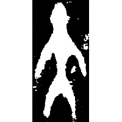
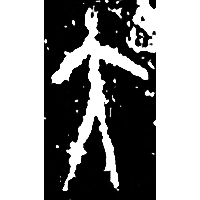
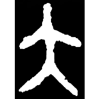
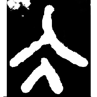
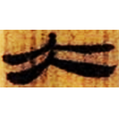
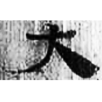
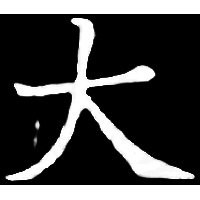

+++
radical = "37"
weight = 1
+++

| Shang | Shang (Shi) | Middle W.Zhou | Zhanguo (Qin) | Qin | W.Han | E.Han | Nanbei (N.Wei) |
| ----- | ----- | ----- | ----- | ----- | ----- | ----- | ----- |
|  |  |  |  |  |  |  |  |
| 集5413.3 | 合20026 | 集2807 | 集證22 | 睡.效43 | 北.老63 | 五.木牘257 | 南0193X |

{夫} \*p(r)a "adult man" & {大} \*lˤats "big"

Depiction of an adult human figure. Initially was created for the word {夫}, but was also used for {大}. Later after the glyph [夫](https://panatesu.github.io/glyph-origins/radicals/37/#U%2b592B) was created, 大 began to be used only for {大}.

- 季旭昇 2014 - 說文新證 \[2nd ed.\] (763-764)
- 姚孝遂 1989 - 再論古漢字的性質
- 劉釗 2011 - 古文字構形學 \[2nd ed.\] (27-28)
- 裘錫圭 2013 - 文字學概要 \[2nd ed.\] \[2021 form.\] (9)
