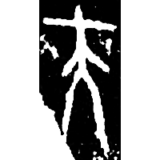
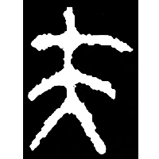
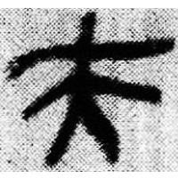
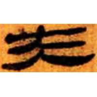
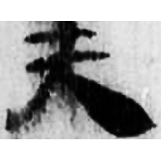
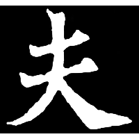

+++
radical = "37"
weight = 1
+++

| Shang (Shi-Bin) | Middle W.Zhou | Qin | W.Han | E.Han | Nanbei (N.Wei) |
| ----- | ----- | ----- | ----- | ----- | ----- |
|  |  |  |  |  |  |
| 合4413 | 集704 | 睡.效40 | 北.老159 | 五.行320 | 南0115X |

{夫} \*p(r)a "adult man" & {大} \*lˤats "big"

[大](https://panatesu.github.io/glyph-origins/radicals/37/#U%2b5927) + differentiative line. Initially 夫 was used for both words {大} and {夫}. Later 夫 began to be used only for {夫}.

- 季旭昇 2014 - 說文新證 \[2nd ed.\] (782)
- 姚孝遂 1989 - 再論古漢字的性質
- 劉釗 2011 - 古文字構形學 \[2nd ed.\] (27-28)
- 裘錫圭 2013 - 文字學概要 \[2nd ed.\] \[2021 form.\] (9)
