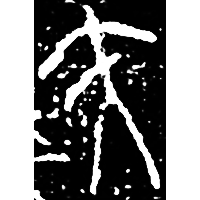
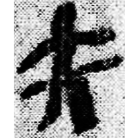
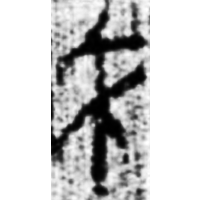
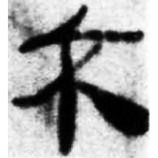
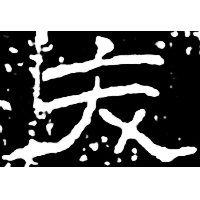
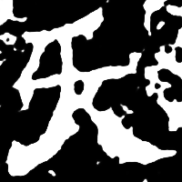
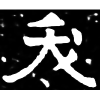

+++
radical = "37"
weight = 1
+++

| Chunqiu (Qin) | Qin | W.Han | W.Han | E.Han | E.Han | Nanbei (N.Wei) | Tang |
| ----- | ----- | ----- | ----- | ----- | ----- | ----- | ----- |
|  |  |  |  |  |  |  |  |
| 陝金1073 [𨥜] | 睡.日甲59背 | 馬.病95 [沃] | 孔.日書472 | 石門頌 | 熹經414 [沃] | 南0261X | 唐1041X |

{腰} \*ʔew "waist" ♪→ {夭} \*ʔ(r)auʔ "to die young"

Depiction of a person ([大](https://panatesu.github.io/glyph-origins/radicals/37/#U%2b5927)) with a pointing line on his waist.

- 謝明文 2013 - 釋金文中的“鋈”字

  
