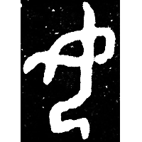
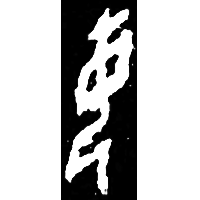
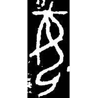
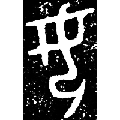
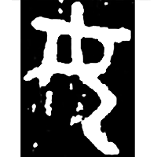
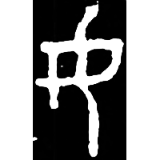
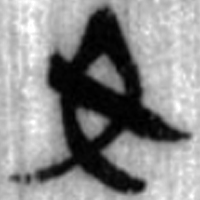
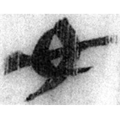
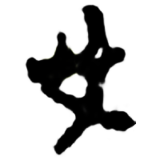

+++
radical = "38"
weight = 1
+++

| Shang | Shang (Bin-Chu) | Shang | Shang | Early W.Zhou | Middle W.Zhou | Zhanguo (Qin) | Qin | Qin | E.Han | Nanbei (N.Wei) |
| ----- | ----- | ----- | ----- | ----- | ----- | ----- | ----- | ----- | ----- | ----- |
|  |  |  |  |  |  |  |  |  |  |  |
| 集9177 | 合11443 | 集1909 | 集856 | 集2672 | 集4276 | 駰乙.背 [如] | 關331 | 北.醫方 | 中原文物1984.3 [婦] | 張玄墓誌 |

?{如} \*na "to obey" ♪→ {女} \*nraʔ "woman" & {母} \*mˤəʔ "mother"

Depiction of a kneeling person with crossed arms. Later a decorative line was added. Initially it was used for both words {女} and {母}. Later after the glyph [母](https://panatesu.github.io/glyph-origins/radicals/80/#U%2b6BCD) was created, 女 began to be used only for {女}.

- 季旭昇 2014 - 說文新證 \[2nd ed.\] (848)
- 姚孝遂 1989 - 再論古漢字的性質
- 劉釗 2011 - 古文字構形學 \[2nd ed.\] (27-28)
- 黃德寬 2014 - 古漢字發展論 (107-108)
