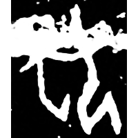
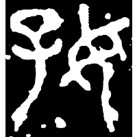
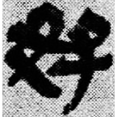
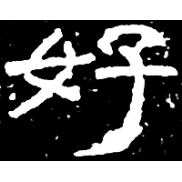
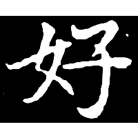

+++
radical = "38"
weight = 1
+++

#### 好¹

| Shang (Bin) | Middle W.Zhou | Chunqiu (Qin) | Qin | E.Han | Nanbei (N.Wei) |
| ----- | ----- | ----- | ----- | ----- | ----- |
|  |  |  |  |  |  |
| 懷882 [包] | 集3754 | 石鼓.吾車 | 睡.日乙241 | 建寧三年殘碑 | 南0265X |

?{抱} \*\[m.p\]ˤuʔ "to embrace" ♪→ {好} \*\[C̥.n\]ˤuʔ "good"

Unknown. Probably differentiated form of [包](https://panatesu.github.io/glyph-origins/radicals/20/#U%2b5305) \*PU (depiction of a person embracing a baby for {抱}).

- 謝明文 2015 - 釋甲骨文中的“抱”——兼論“包”字

#### 好²

{好} \*\[ts\]əʔ "*Zi* (female surname)"

[女](https://panatesu.github.io/glyph-origins/radicals/38/#U%2b5973) *WOMAN* + ♪[子](https://panatesu.github.io/glyph-origins/radicals/39/#U%2b5B50) \*TSƏ.

- 曹定雲 1993 - 殷墟婦好墓銘文研究
- Childs-Johnson E. 2003 - Fu Zi: The Shang Woman Warrior
