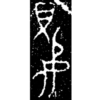
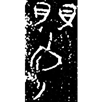
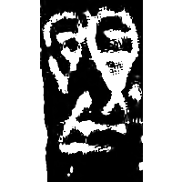
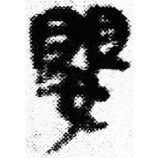
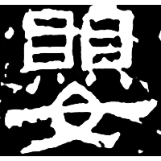
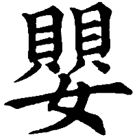

+++
radical = "38"
weight = 1
+++

| Chunqiu (Chu) | Chunqiu (Chu) | Zhanguo (Qin) | Qin | E.Han | Tang |
| ----- | ----- | ----- | ----- | ----- | ----- |
|  |  |  |  |  |  |
| 集10386 | 集52 | 近出1193 | 睡.種69 | 熹經297 | 五經文字 |

{嬰} \*ʔeŋ "necklace" ♪→ {嬰} \*ʔeŋ "baby"

One or two [貝](https://panatesu.github.io/glyph-origins/radicals/154/#U%2b8C9D) *COWRIE* + ♪[⿱口女](https://panatesu.github.io/glyph-origins/radicals/215/#%E2%BF%B1%E5%8F%A3%E5%A5%B3) \*ɁEŊ (depiction of a person ([女](https://panatesu.github.io/glyph-origins/radicals/38/#U%2b5973)) with a goitre for {癭} \*ʔeŋʔ "goitre").

- 馮勝君 2009 - 試說東周文字中部分“嬰”及從“嬰”之字的聲符——兼釋甲骨文中的“癭”和“頸”

  

  
