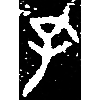
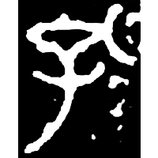
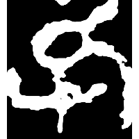
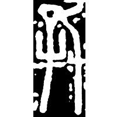
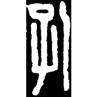
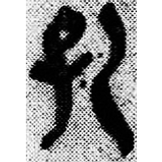
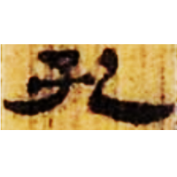
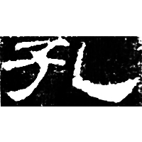
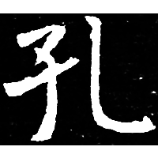

+++
radical = "39"
weight = 1
+++

| Shang (Funü) | Late W.Zhou | Chunqiu (Qin) | Qin | Qin | Qin | Qin | W.Han | E.Han | Nanbei (N.Wei) |
| ----- | ----- | ----- | ----- | ----- | ----- | ----- | ----- | ----- | ----- |
|  |  |  |  |  |  |  |  |  |  |
| 合22256 [乳] | 集10173 | 石鼓.汧沔 | 陶新2634 | 秦風170 | 秦風212 | 睡.日甲69背 | 北.老176 | 乙瑛碑 | 元文墓誌 |

{㝅} \*\[k\]ˤoks "to breastfeed" ♪→ {孔} \*\[k\]ʰˤoŋʔ "hole"

Depiction of a baby ([子](https://panatesu.github.io/glyph-origins/radicals/39/#U%2b5B50)) with an open mouth turned diagonally.

- 張富海 2017 - 說字二則
