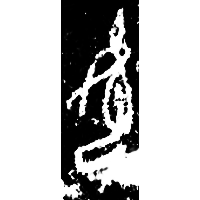
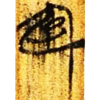
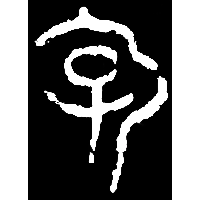
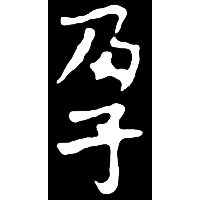
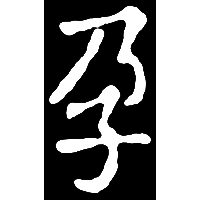

+++
radical = "39"
weight = 1
+++

| Shang (Shi) | Shang (Shi-Bin) | Shang (Bin) | Zhanguo (Chu) | Zhanguo (Qin) | Nanbei (N.Wei) | Sui |
| ----- | ----- | ----- | ----- | ----- | ----- | ----- |
|  |  |  |  |  |  |  |
| 合21071 | 合21207 | 英494反 | 上三.周50 | 吳詛楚.湫淵 | 長孫子澤墓誌 | 段威墓誌 |

{孕} \*l\[i\]ŋs "to be pregnant"

Depiction of a person ([人](https://panatesu.github.io/glyph-origins/radicals/9/#U%2b4EBA)/[女](https://panatesu.github.io/glyph-origins/radicals/38/#U%2b5973)) with a child ([子](https://panatesu.github.io/glyph-origins/radicals/39/#U%2b5B50)) in his belly.

- 季旭昇 2014 - 說文新證 \[2nd ed.\] (971)
