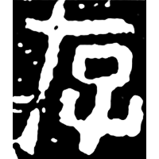
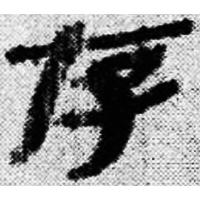
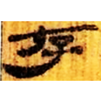
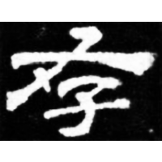

+++
radical = "39"
weight = 1
+++

| Qin | Qin | W.Han | E.Han | Nanbei (N.Wei) | Tang |
| ----- | ----- | ----- | ----- | ----- | ----- |
|  |  |  |  |  |  |
| 陶錄6.439.3 | 睡.問98 | 北.老12 | 華山廟碑 | 南0036X | 五經文字 |

{在} \*\[dz\]ˤəʔ "to exist" → {存} \*\[dz\]ˤə\[n\] "to exist"

♪[才](https://panatesu.github.io/glyph-origins/radicals/64/#U%2b624D) \*TSƏ + ♪[子](https://panatesu.github.io/glyph-origins/radicals/39/#U%2b5B50) \*TSƏ. Later a synonymous word {存} became the main one for this glyph.

- 王寧 2017 - 清華簡《祭公之顧命》與《逸周書・祭公》對讀一則
- 李守奎 & 王永昌 2018 - 段玉裁古諧聲偏旁分部互用說的文字學觀察——兼論漢字中的“假形聲字”
