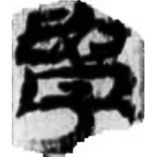
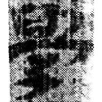
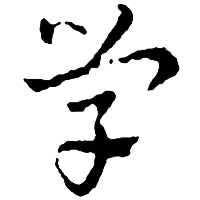
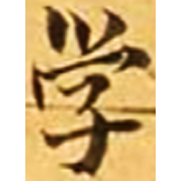

+++
radical = "39"
weight = 1
+++

| Han | Sanguo (Wu) | Sanguo (Wu) | Tang |
| ----- | ----- | ----- | ----- |
|  |  |  |  |
| 敦481 | 走四920 | 皇象 | S.2672 |

Shortening of [學](https://panatesu.github.io/glyph-origins/radicals/39/#U%2b5B78) based on the cursive form. Modern simplified form of [學](https://panatesu.github.io/glyph-origins/radicals/39/#U%2b5B78) in China and Japan.

- Bökset R. 2021 - Long Story of Short Forms: Simplified Chinese Characters from A to Z (325)
