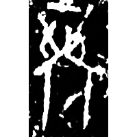
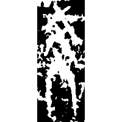
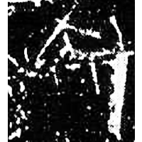
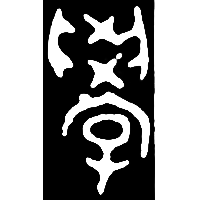
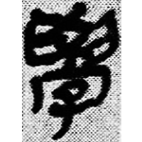
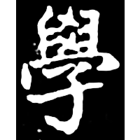

+++
radical = "39"
weight = 1
+++

| Shang (Shi) | Shang (Bin) | Shang (Huadong) | Shang (Bin) | Shang (He) | Early W.Zhou | Late W.Zhou | Qin | E.Han | Nanbei (N.Wei) |
| ----- | ----- | ----- | ----- | ----- | ----- | ----- | ----- | ----- | ----- |
|  |  |  |  |  |  |  |  |  |  |
| 合20100 [⿱𦥑宀] | 合8304 [⿱爻宀] | 花181 [⿳爻宀𠬞] | 合3511 [⿱⿴𦥑㐅宀] | 合27712 [𦥯] | 集2803 | 集4324.1 | 睡.日乙14 | 漢0061A | 南0068X |

{學} \*m.kˤruk "to study" & {教} \*s.\[k\]ˤraw "to teach"

Initially the word {學} was written as [⿱𦥑宀](https://panatesu.github.io/glyph-origins/radicals/215/#%E2%BF%B1%F0%A6%A5%91%E5%AE%80) or [⿱宀𠬞](https://panatesu.github.io/glyph-origins/radicals/215/#%E2%BF%B1%E5%AE%80%F0%A0%AC%9E) ([宀](https://panatesu.github.io/glyph-origins/radicals/40/#U%2b5B80) *ROOM* + [𦥑](https://panatesu.github.io/glyph-origins/radicals/134/#U%2b26951)/[𠬞](https://panatesu.github.io/glyph-origins/radicals/29/#U%2b20B1E) ♪\*KUK (depiction of both hands holding something for {掬} \*kuk "to hold with both hands")). Later ♪[爻](https://panatesu.github.io/glyph-origins/radicals/89/#U%2b723B)/㐅 \*KAW used for {教} was added, fusing the glyphs so it could be used for both words {學} and {教}. Later [子](https://panatesu.github.io/glyph-origins/radicals/39/#U%2b5B50) *CHILD* was added. After the glyph [教](https://panatesu.github.io/glyph-origins/radicals/66/#U%2b6559) was created, 學 began to be used only for {學}.

- 季旭昇 2014 - 說文新證 \[2nd ed.\] (247-248)

**Forms:**

[学](https://panatesu.github.io/glyph-origins/radicals/39/#U%2b5B66) - Shortening based on the cursive form. Modern simplified form in China and Japan.
