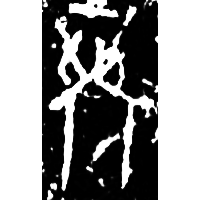
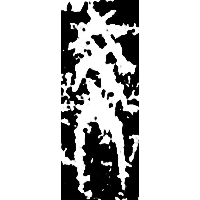
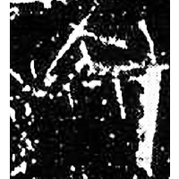
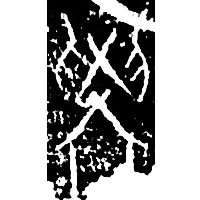
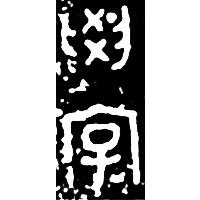
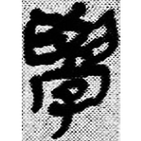
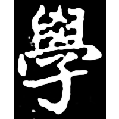

+++
radical = "39"
weight = 1
+++

| Shang (Shi) | Shang (Bin) | Shang (Huadong) | Shang (Bin) | Shang (He) | Early W.Zhou | Late W.Zhou | Qin | E.Han | Nanbei (N.Wei) |
| ----- | ----- | ----- | ----- | ----- | ----- | ----- | ----- | ----- | ----- |
|  |  |  |  |  |  |  |  |  |  |
| 合20100 [⿱𦥑宀] | 合8304 [⿱爻宀] | 花181 [⿳爻宀𠬞] | 合3511 [⿱⿴𦥑㐅宀] | 合27712 [𦥯] | 集2803 | 集4324.1 | 睡.日乙14 | 漢0061A | 南0068X |

{學} \*m.kˤruk "to study" & {教} \*s.\[k\]ˤraw "to teach"

Initially the word {學} was written as  or  ( *ROOM* + / ♪\*KUK (depiction of both hands holding something for {掬} \*kuk "to hold with both hands")). Later ♪/² \*KAW used for {教} was added, fusing the glyphs so it could be used for both words {學} and {教}. Later  *CHILD* was added. After the glyph  was created, 學 began to be used only for {學}.

- 季旭昇 2014 - 說文新證 \[2nd ed.\] (247-248)

**Forms:**

 - Shortening based on the cursive form. Modern simplified form in China and Japan.
