+++
radical = "40"
weight = 1
+++

#### 安¹

| Shang | Shang (Huadong) | Shang (Bin) | Shang (Huang) | Middle W.Zhou | Zhanguo (Qin) | Qin | W.Han | W.Han | E.Han | Nanbei (N.Wei) |
| ----- | ----- | ----- | ----- | ----- | ----- | ----- | ----- | ----- | ----- | ----- |
| 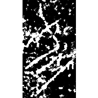 | 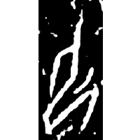 | 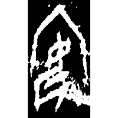 | 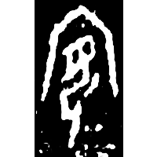 | 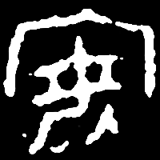 | 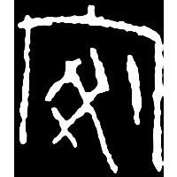 | 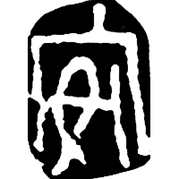 | 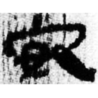 | 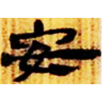 | 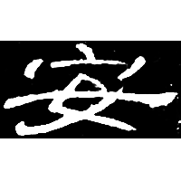 | 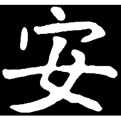 |
| 大辛莊T2302[5]B:1 [𱙁] | 花285 [⿱卩一] | 合5373 | 合37568 | 集2719 | 宜安戈 | 珍秦23 | 銀二1324 | 北.老161 | 曹全碑 | 南0357X |

{安} \*ʔˤan "to sit"

Initially the word {安} was written as [𱙁](https://panatesu.github.io/glyph-origins/radicals/38/#U%2b31641) or [⿱卩一](https://panatesu.github.io/glyph-origins/radicals/215/#%E2%BF%B1%E5%8D%A9%E4%B8%80) (depiction of a kneeling person ([女](https://panatesu.github.io/glyph-origins/radicals/38/#U%2b5973)/[卩](https://panatesu.github.io/glyph-origins/radicals/26/#U%2b5369)) with a line under his buttocks, either conveying the idea of sitting or representing a mat). Later [宀](https://panatesu.github.io/glyph-origins/radicals/40/#U%2b5B80) *ROOM* was added.

- 陳劍 2005 - 說“安”字
- 季旭昇 2014 - 說文新證 \[2nd ed.\] (592-593)

#### 安²

{賓} \*pin "guest"

Depiction of a kneeling person ([女](https://panatesu.github.io/glyph-origins/radicals/38/#U%2b5973)) inside a room ([宀](https://panatesu.github.io/glyph-origins/radicals/40/#U%2b5B80)).

- 陳劍 2005 - 說“安”字
