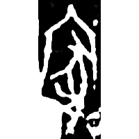
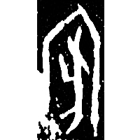
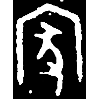
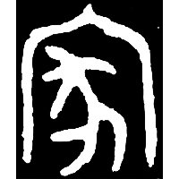
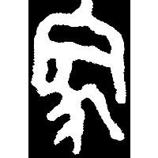
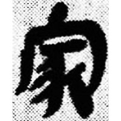
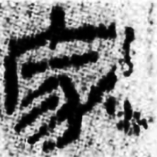
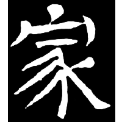
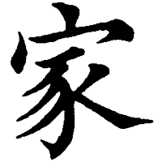

+++
radical = "40"
weight = 1
+++

| Shang (Shi) | Shang (Li) | Early W.Zhou | Late W.Zhou | Zhanguo (Qin) | Qin | W.Han | W.Jin | Tang |
| ----- | ----- | ----- | ----- | ----- | ----- | ----- | ----- | ----- |
|  |  |  |  |  |  |  |  |  |
| 合補1265 | 屯332 | 集2660 | 集9731.1 | 駰乙.背 | 睡.日乙18 | 銀二1832 | 郭槐柩記 | 五經文字 |

{家} \*kˤra "home"

[宀](https://panatesu.github.io/glyph-origins/radicals/40/#U%2b5B80) *ROOM* + ♪[𢑓](https://panatesu.github.io/glyph-origins/radicals/58/#U%2b22453) \*KA (\> 豕).

- 唐蘭 1935 - 天壌閣甲骨文存考釋 (35)
- 黃德寬 (ed.) 2007 - 古文字譜系疏證 (1358-1360)
