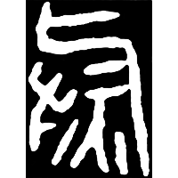
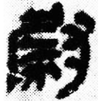
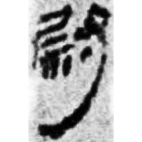

+++
radical = "41"
weight = 1
+++

| Qin | Qin | W.Han | E.Han | Nanbei (N.Wei) | Tang |
| ----- | ----- | ----- | ----- | ----- | ----- |
|  |  |  |  |  |  |
| 珍秦213 | 睡.效54 | 張.二145 | 曹全碑 | 高廣墓誌 | 唐1404C |

?{熨} \*ʔut "iron" ♪→ {尉} \*ʔuts "officer"

Unknown. Either [火](https://panatesu.github.io/glyph-origins/radicals/86/#U%2b706B) *FIRE* + [寸](https://panatesu.github.io/glyph-origins/radicals/41/#U%2b5BF8) *HAND* + 𡰥? (uncertain, probably related to [厃](https://panatesu.github.io/glyph-origins/radicals/27/#U%2b5383)) for {熨} or somehow related to [㕟](https://panatesu.github.io/glyph-origins/radicals/29/#U%2b355F) \*KUT.

- 大西克也 2003 - 試論上博楚簡《緇衣》中的“厃”字及相關諸字
- 布之道 2022 - 廣韻形聲考

  
