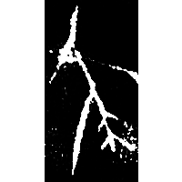
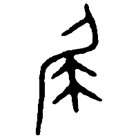
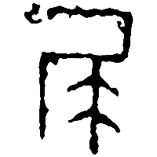
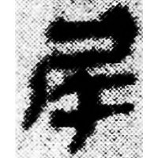
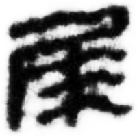

+++
radical = "44"
weight = 1
+++

| Shang (Bin) | Chunqiu (Deng) | Zhanguo (Jin) | Qin | W.Han | E.Han | Nanbei (N.Wei) | Tang |
| ----- | ----- | ----- | ----- | ----- | ----- | ----- | ----- |
|  |  |  |  |  |  |  |  |
| 合136正 | 新收1231 [𡱵] | 錢典91 | 睡.日甲56 | 馬.二36下 | 石門頌 | 元昭墓誌 | 五經文字 |

{尾} \*\[m\]әjʔ "tail"

Depiction of a person ([人](https://panatesu.github.io/glyph-origins/radicals/9/#U%2b4EBA) \> 尸) with a tail-like accessory (symbol of a low class).

- 季旭昇 2014 - 說文新證 \[2nd ed.\] (679-680)
