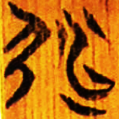
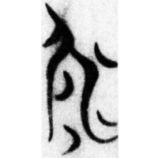
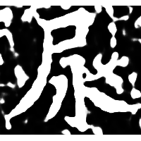
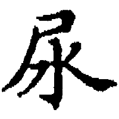

+++
radical = "44"
weight = 1
+++

| Chunqiu (Chu) | Zhanguo (Chu) | Zhanguo (Chu) | Nanbei (E.Wei) | N.Song |
| ----- | ----- | ----- | ----- | ----- |
|  |  |  |  |  |
| 集261.2 [弱] | 清四.筮法48 | 郭.語一36 | 南0471B | 廣韻 |

{尿/溺} \*kə.nˤewks "to urinate"

Shortened form of [弱](https://panatesu.github.io/glyph-origins/radicals/57/#U%2b5F31) \*NEWK with [弓](https://panatesu.github.io/glyph-origins/radicals/57/#U%2b5F13) > 尸.

- 謝明文 2017 - 談談甲骨文中可能用作“庭”的一個字
- 鄔可晶 2022 - “弱”、“約”有關字詞的考察
