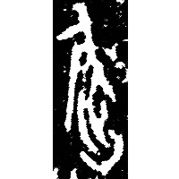
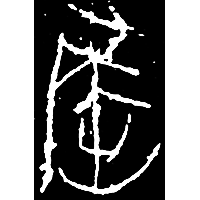
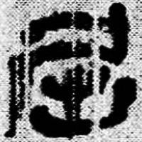
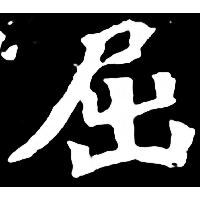

+++
radical = "44"
weight = 1
+++

| Chunqiu (Chu) | Qin | Qin | W.Han | Nanbei (N.Wei) |
| ----- | ----- | ----- | ----- | ----- |
|  |  |  |  |  |
| 銘圖16696 | 陶6.162.3 | 睡.爲34 | 北.老137 | 南0181X |

{屈} \*Nə.\[kʰ\]ut "short (tail)" ♪→ {屈} \*\[kʰ\]ut "to bend"

[尾](https://panatesu.github.io/glyph-origins/radicals/44/#U%2b5C3E) *TAIL* + ♪[出](https://panatesu.github.io/glyph-origins/radicals/17/#U%2b51FA) \*KUT.

- 季旭昇 2014 - 說文新證 \[2nd ed.\] (680-681)
