+++
radical = "44"
weight = 1
+++

| Shang (Bin) | Shang (Li) | Middle W.Zhou | Middle W.Zhou | Late W.Zhou | Chunqiu | Qin | W.Han | E.Han | Nanbei (N.Qi) | Tang |
| ----- | ----- | ----- | ----- | ----- | ----- | ----- | ----- | ----- | ----- | ----- |
| 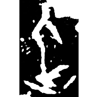 | 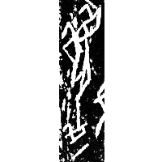 | 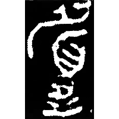 | 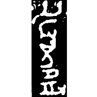 | 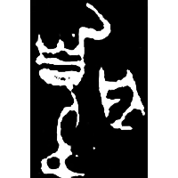 | 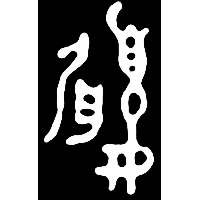 | 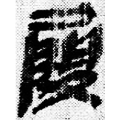 | 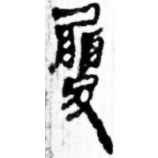 | 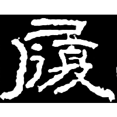 | 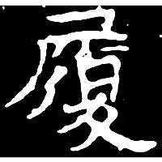 | 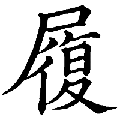 |
| 合18982 [⿱企一] | 合33283 | 集2832 | 歷文2002.1 | 集10134 | 銘圖續1108 | 睡.答162 | 馬.遣一261 | 石門頌 | 石信墓誌 | 五經文字 |

{履} \*\[r\]ijʔ "to put on shoes"

Initially the word {履} was written as [⿱企一](https://panatesu.github.io/glyph-origins/radicals/215/#%E2%BF%B1%E4%BC%81%E4%B8%80) (depiction of a person with a covered foot). Later ♪[眉](https://panatesu.github.io/glyph-origins/radicals/109/#U%2b7709) \*R(M)ƏJ was added.

- 裘錫圭 1991 - 西周銅器銘文中的“履”
- 袁倫強 2022 - 甲骨文“履”字補釋
