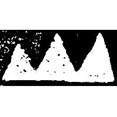
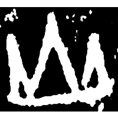
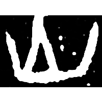
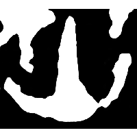
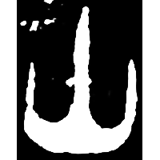
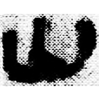
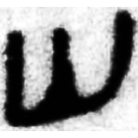
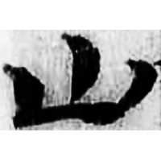
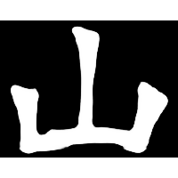

+++
radical = "46"
weight = 1
+++

| Shang | Shang (Bin) | Shang (Li) | Shang (Huang) | Late W.Zhou | Qin | W.Han | E.Han | Nanbei (N.Wei) |
| ----- | ----- | ----- | ----- | ----- | ----- | ----- | ----- | ----- |
|  |  |  |  |  |  |  |  |  |
| 集6496 | 合6571正 | 合34203 [岳*] | 合37403 [⿱⿰⿸虍𣦵⿸虍𣦵山] | 集2836 | 睡.爲22 | 銀一345 | 五.木牘291A | 穆紹墓誌 |

{山} \*sV.ŋrar "mountain"

Depiction of three mountain peaks.

- 季旭昇 2014 - 說文新證 \[2nd ed.\] (721)

  
