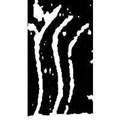
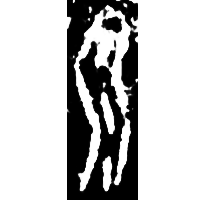
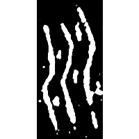
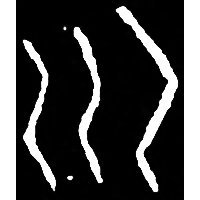
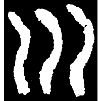
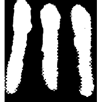
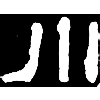

+++
radical = "47"
weight = 1
+++

| Shang (Shi-Bin) | Shang (Wu) | Shang (Li) | Shang (Wuming) | Middle W.Zhou | Zhanguo (Qin) | Qin | E.Han | Nanbei (N.Qi) |
| ----- | ----- | ----- | ----- | ----- | ----- | ----- | ----- | ----- |
|  |  |  |  |  |  |  |  |  |
| 合24441 | 英1921 | 屯2161 | 合28180 | 近二458 | 駰乙.正 | 陶錄6.284.4 | 朐忍令碑 | 竇泰墓誌 |

{川} \*(C)Vt.lu\[r\] "river"

Depiction of water flowing between two banks.

- 季旭昇 2014 - 說文新證 \[2nd ed.\] (803)
