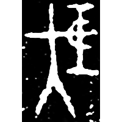
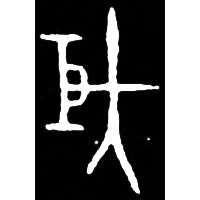
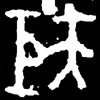
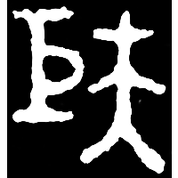
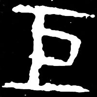
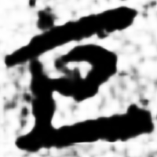
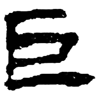
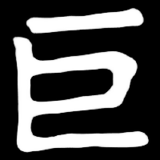

+++
weight = 1
radical = "48"
+++

| Early W.Zhou | Early W.Zhou | Middle W.Zhou | Middle W.Zhou | Qin | Han | E.Han | Nanbei (N.Qi) |
| ----- | ----- | ----- | ----- | ----- | ----- | ----- | ----- |
|  |  |  |  |  |  |  |  |
| 集2170 [𭑌] | 集893 [𭑌] | 集2831 [𭑌] | 集9456 [𭑌] | 陶錄6.329.4 | 敦238A | 文物2002.12 | 南0545X |

{矩} \*kʷ(r)aʔ "carpenter's square" ♪→ {巨} \*ɡ(r)aʔ "gigantic"

Depiction of a person ([大](https://panatesu.github.io/glyph-origins/radicals/37/#U%2b5927)/[夫](https://panatesu.github.io/glyph-origins/radicals/37/#U%2b592B)) holding a carpenter's square. Later shortens to a form without the person.

- 季旭昇 2014 - 說文新證 \[2nd ed.\] (382-383)