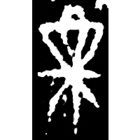
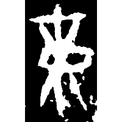
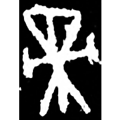
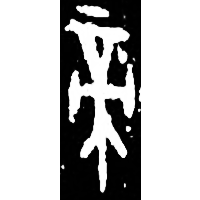
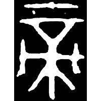
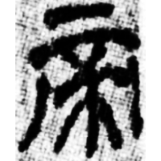
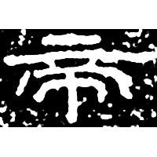

+++
radical = "50"
weight = 1
+++

| Shang (Shi) | Shang (Bin) | Shang (Bin) | Shang (He) | Late W.Zhou | Qin | W.Han | E.Han | Nanbei (N.Wei) | Tang |
| ----- | ----- | ----- | ----- | ----- | ----- | ----- | ----- | ----- | ----- |
|  |  |  |  |  |  |  |  |  |  |
| 合21080 | 合14159 | 合10172 | 合30592 | 集2743 | 陶錄6.347.2 | 銀二2019 | 石門頌 | 南0193X | 唐玄秘塔碑 |

?{禘} \*tˤeks "*di* sacrifice" ♪→ {帝} \*tˤeks "highest god; emperor"

Unknown. Probably depiction of the firewood used in the *di* sacrifice.

- 季旭昇 2014 - 說文新證 \[2nd ed.\] (45-46)
