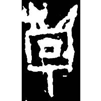
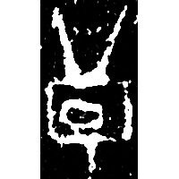
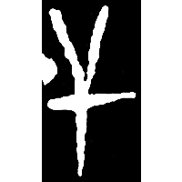
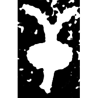
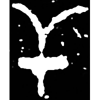
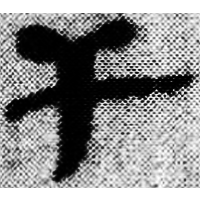
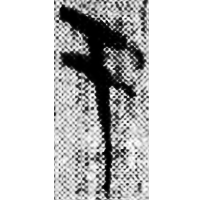
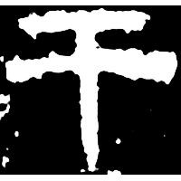
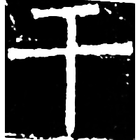

+++
radical = "51"
weight = 1
+++

| Shang (Shi-Bin) | Shang (Shi-Bin) | Shang (Wuming) | Middle W.Zhou | Late W.Zhou | Qin | Qin | E.Han | Nanbei (N.Wei) |
| ----- | ----- | ----- | ----- | ----- | ----- | ----- | ----- | ----- |
|  |  |  |  |  |  |  |  |  |
| 合9801 | 合4945 | 合28059 | 集4167 | 集4468 | 睡.種172 | 里耶8-1764 | 衡方碑 | 弔比干文陽 |

{干} \*kˤa\[r\] "shield"

Depiction of a shield with a decoration at the top.

- 林澐 2000 - 說干、盾
- 蘇建洲 2021 - 西周金文“干”字再議
