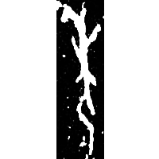
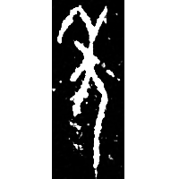
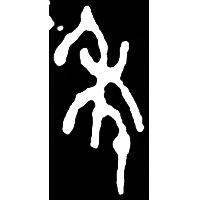
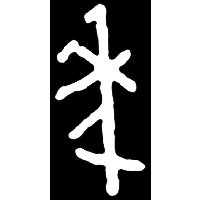
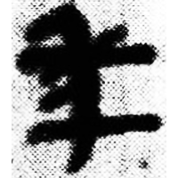
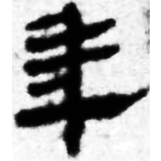
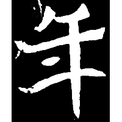
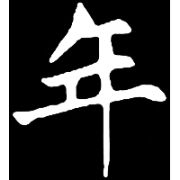

+++
radical = "51"
weight = 1
+++

| Shang (Shi) | Shang (Bin) | Middle W.Zhou | Late W.Zhou | Zhanguo (Qin) | Zhanguo (Qin) | Qin | W.Han | E.Han | Nanbei (N.Wei) | Nanbei (N.Wei) | Nanbei (N.Wei) |
| ----- | ----- | ----- | ----- | ----- | ----- | ----- | ----- | ----- | ----- | ----- | ----- |
|  |  |  |  |  |  |  |  |  |  |  |  |
| 合20652 | 合846 | 集2838 | 集2585 | 集10372 | 珍秦金56 | 睡.日乙103 | 馬.經15下 | 華山廟碑 | 寇臻墓誌 | 元簡墓誌殘石 | 鄭黑墓誌 |

{年} \*CV.nˤiŋ "harvest"

[禾](https://panatesu.github.io/glyph-origins/radicals/115/#U%2b79BE) *GRAIN* + ♪[人](https://panatesu.github.io/glyph-origins/radicals/9/#U%2b4EBA) \*NIŊ (\> 千).

- 李孝定 1982 - 金文詁林讀後記
- 張世超 & al. 1996 - 金文形義通解 (1786-1787)
