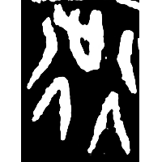
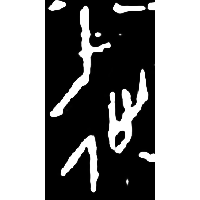
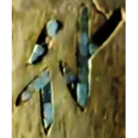
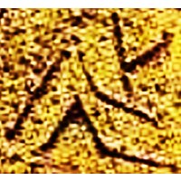
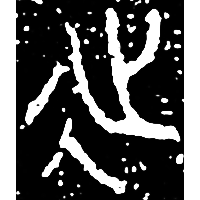
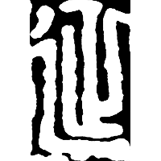
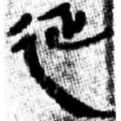
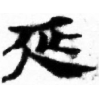
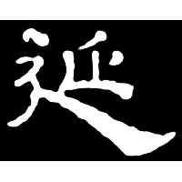
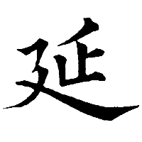

+++
radical = "54"
weight = 1
+++

| Shang (Shi-Bin) | Shang (Huadong) | Shang (He) | Shang (Huang) | Early W.Zhou | Middle W.Zhou | Qin | W.Han | Han | E.Han | Nanbei (N.Wei) | Tang |
| ----- | ----- | ----- | ----- | ----- | ----- | ----- | ----- | ----- | ----- | ----- | ----- |
|  |  |  |  |  |  |  |  |  |  |  |  |
| 合3203 | 花382 | 合30771 | 大墓M11 | FQ3 | 集4214 | 秦風213 | 張.二4 | 居舊88.12 | 華山廟碑 | 南0237A | 五經文字 |

{延} \*la\[n\] "to extend"

Depiction of a foot ([止](https://panatesu.github.io/glyph-origins/radicals/77/#U%2b6B62)) on a road ([行](https://panatesu.github.io/glyph-origins/radicals/144/#U%2b884C)/[彳](https://panatesu.github.io/glyph-origins/radicals/60/#U%2b5F73)).

- 季旭昇 2014 - 說文新證 \[2nd ed.\] (136-138)
