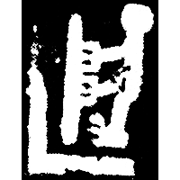
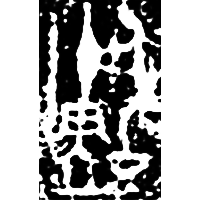
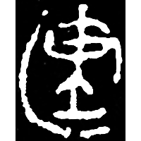
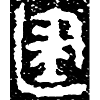
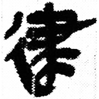
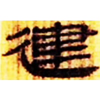
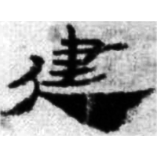
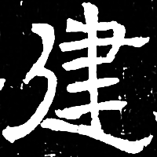
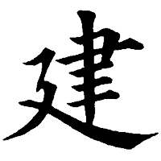

+++
radical = "54"
weight = 1
+++

| Shang | Shang (Huang) | Early W.Zhou | Late W.Zhou | Late W.Zhou | Qin | W.Han | Han | W.Jin | Tang |
| ----- | ----- | ----- | ----- | ----- | ----- | ----- | ----- | ----- | ----- |
|  |  |  |  |  |  |  |  |  |  |
| 集6921 | 合36908 | 集2556A | 近出28 | 近二328 | 睡.日乙29 | 北.老45 | 懸帛2 | 魏晉0020X | 五經文字 |

{建} \*\[k\]a\[n\]s "to build; to erect"

Depiction of a person erecting a pillar.

- 裘錫圭 1989 - 釋“建”
