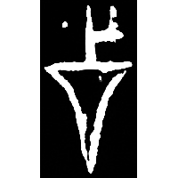
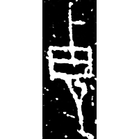
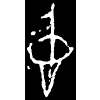
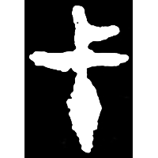
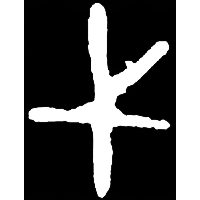
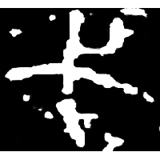
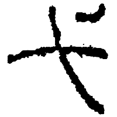
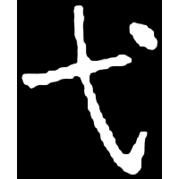

+++
radical = "56"
weight = 1
+++

| Shang (Shi) | Shang (Bin) | Shang (Bin) | Middle W.Zhou | Middle W.Zhou | Qin | Han | Nanbei N.Wei |
| ----- | ----- | ----- | ----- | ----- | ----- | ----- | ----- |
|  |  |  |  |  |  |  |  |
| 合19946反 | 懷957 | 合6816 | 集2824 | 集10175 | 傅492 | 汝183 | 元誘墓誌 |

{杙} \*lək "wooden peg" ♪→ {弋} \*lək "arrow with a string"

Depiction of a peg.

- 裘錫圭 1980 - 釋“柲”・附：釋“弋”
- 季旭昇 2014 - 說文新證 \[2nd ed.\] (857-858)
