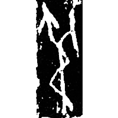
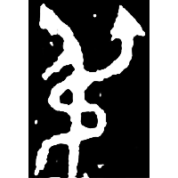
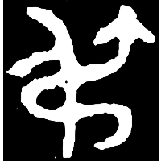
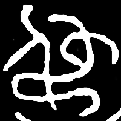
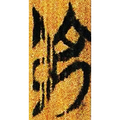
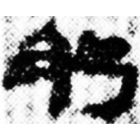
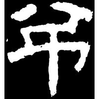
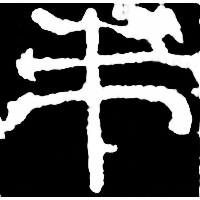
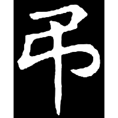

+++
radical = "57"
weight = 1
+++

| Shang (Bin) | Shang (Ya) | Early W.Zhou | Late W.Zhou | Chunqiu (Qin) | Zhanguo (Chu) | W.Han | E.Han | E.Han | Nanbei (N.Wei) |
| ----- | ----- | ----- | ----- | ----- | ----- | ----- | ----- | ----- | ----- |
|  |  |  |  |  |  |  |  |  |  |
| 合18463正 | 合22301 | 集3724 | 集3760 | 集證83 [盄] | 上六.用曰20 | 武.甲服58 | 衡方碑 | 夏承碑 | 胡明相墓誌 |

?{毒} \*\[d\]ˤuk "poison" ♪→ {弔} \*tˤ\[i\]wk "to reach"

Depiction of a snake ([虫](https://panatesu.github.io/glyph-origins/radicals/142/#U%2b866B)) coiling around a person ([人](https://panatesu.github.io/glyph-origins/radicals/9/#U%2b4EBA)).

- 白於藍 & 王錦城 2019 - 釋“弔”
