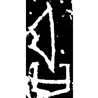
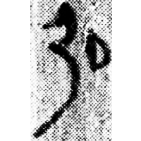
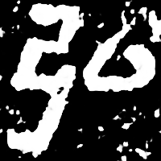
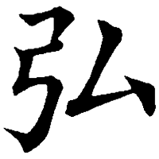

+++
radical = "57"
weight = 1
+++

| Shang (Bin) | Shang (Bin) | Shang (Huang) | Early W.Zhou | Qin | Qin | E.Han | Nanbei (N.Wei) | Tang |
| ----- | ----- | ----- | ----- | ----- | ----- | ----- | ----- | ----- |
|  |  |  |  |  |  |  |  |  |
| 合3083正 | 合4771 | 合35673 | 集5257 | 秦印編250 | 里耶8-1554正 | 圉令趙君碑 | 楊範墓誌 | 五經文字 |

{弘} \*\[w\]ˤəŋ "grand"

♪[弓](https://panatesu.github.io/glyph-origins/radicals/57/#U%2b5F13) \*\[W\]ƏŊ + differentiative 口.

- 裘錫圭 1982 - 甲骨文字考釋(續)・釋“弘”“強”
