+++
radical = "57"
weight = 1
+++

| Shang (Bin) | Shang (Bin) | Zhanguo (Chu) | Zhanguo (Chu) | Zhanguo (Chu) | Qin | W.Han | Han | Han | Sanguo (Wu) | Nanbei (N.Wei) | Tang |
| ----- | ----- | ----- | ----- | ----- | ----- | ----- | ----- | ----- | ----- | ----- | ----- |
| 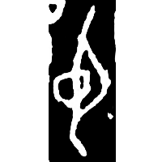 | 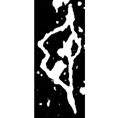 | 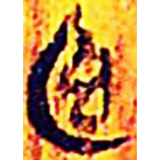 | 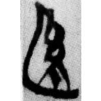 | 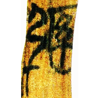 | 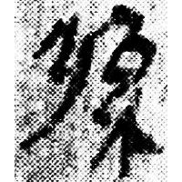 | 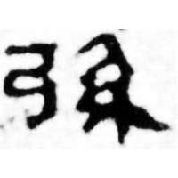 | 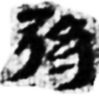 | 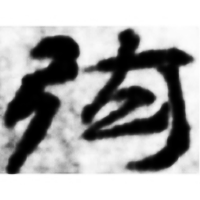 | 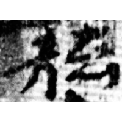 | 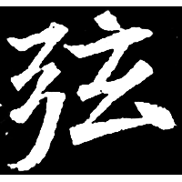 | 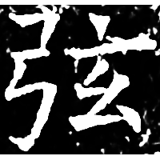 |
| 合10458 | 合9410正 | 清二.繫年46 | 曾乙56 | 上六.用12 | 里耶8-458 | 馬.相43 | 居新EPT59:165 | 居新EPF22:308 | 走莂5.440 | 寇憑墓誌 | 開石.儀禮3 |

{弦} \*ɡˤin "bowstring"

Depiction of a bow ([弓](https://panatesu.github.io/glyph-origins/radicals/57/#U%2b5F13)) with an indicative circle on the bowstring. Later the bowstring was changed into [糸](https://panatesu.github.io/glyph-origins/radicals/120/#U%2b7CF8) *STRING*, and [弓](https://panatesu.github.io/glyph-origins/radicals/57/#U%2b5F13) *BOW* was added. Then the right element was changed into ♪[玄](https://panatesu.github.io/glyph-origins/radicals/95/#U%2b7384) \*KIN.

- 李守奎 & 肖攀 2015 - 清華簡《系年》文字考釋與構形研究・幺、玄、糸、𢆶、絲等相關字考
- 王子楊 2023 - 甲骨文“弦”字補釋——兼談“弦”與“幻”的關係
- 季旭昇 2014 - 說文新證 \[2nd ed.\] (882-883)
