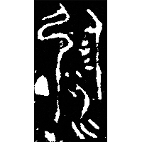
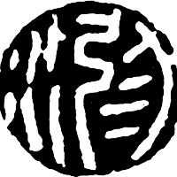
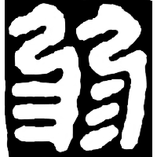
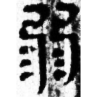
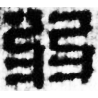
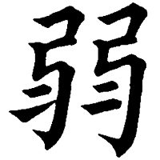
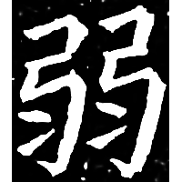

+++
radical = "57"
weight = 1
+++

| Chunqiu (Chu) | Qin | Qin | W.Han | W.Han | E.Han | Tang | Ming |
| ----- | ----- | ----- | ----- | ----- | ----- | ----- | ----- |
|  |  |  |  |  |  |  |  |
| 集261 | 珍秦99 | 珍展139 | 張.脈5 | 馬.相16 | 桐柏淮源廟碑 | 五經文字 | 明0248X |

{尿/溺} \*kə.nˤewks "to urinate" ♪→ {弱} \*newk "weak"

[水](https://panatesu.github.io/glyph-origins/radicals/85/#U%2b6C34) *WATER* + ♪[⿰弓⿹弓彡](https://panatesu.github.io/glyph-origins/radicals/215/#%E2%BF%B0%E5%BC%93%E2%BF%B9%E5%BC%93%E5%BD%A1) \*NEWK ([弓](https://panatesu.github.io/glyph-origins/radicals/57/#U%2b5F13) *BOW* + ♪[⿹弓彡](https://panatesu.github.io/glyph-origins/radicals/215/#%E2%BF%B9%E5%BC%93%E5%BD%A1) \*NEWK for {弱} \*newk "weak").

- 謝明文 2017 - 談談甲骨文中可能用作“庭”的一個字
- 鄔可晶 2022 - “弱”、“約”有關字詞的考察
