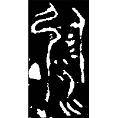
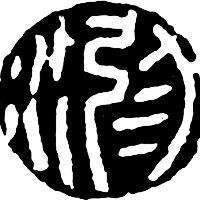
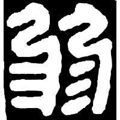
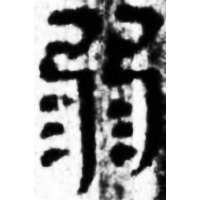
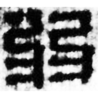
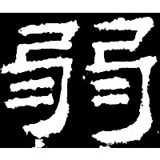
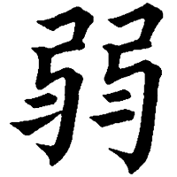
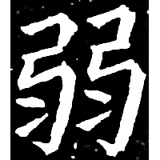

+++
radical = "57"
weight = 1
+++

| Chunqiu (Chu) | Qin | Qin | W.Han | W.Han | E.Han | Tang | Ming |
| ----- | ----- | ----- | ----- | ----- | ----- | ----- | ----- |
|  |  |  |  |  |  |  |  |
| 集261 | 珍秦99 | 珍展139 | 張.脈5 | 馬.相16 | 桐柏淮源廟碑 | 五經文字 | 明0248X |

{尿/溺} \*kə.nˤewks "to urinate" ♪→ {弱} \*newk "weak"

 *WATER* + ♪ \*NEWK ( *BOW* + ♪ \*NEWK for {弱} \*newk "weak").

- 謝明文 2017 - 談談甲骨文中可能用作“庭”的一個字
- 鄔可晶 2022 - “弱”、“約”有關字詞的考察
