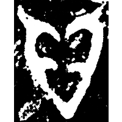
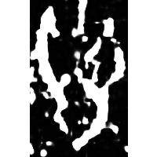
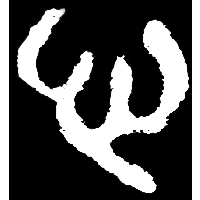
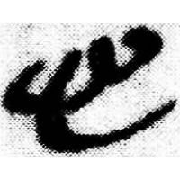
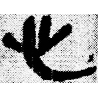
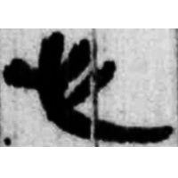
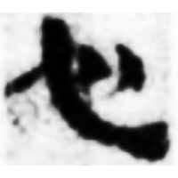
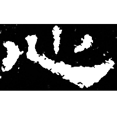
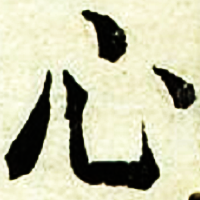

+++
radical = "61"
weight = 1
+++

| Shang | Shang (Bin) | Shang (Wuming) | Middle W.Zhou | Zhanguo (Qin) | Qin | Qin | Qin | Han | E.Han | Nanbei (N.Wei) | Ming |
| ----- | ----- | ----- | ----- | ----- | ----- | ----- | ----- | ----- | ----- | ----- | ----- |
|  |  |  |  |  |  |  |  |  |  |  |  |
| 集8554 | 合3025 | 合29004 [𢘅] | 集10175 | 駰乙.背 | 睡.法52 | 睡.日乙97 | 睡.日乙102 | 武醫44 | 漢0061B | 南0265X | 字彙 |

{心} \*səm "heart"

Depiction of a heart.

- 于省吾 1979 - 甲骨文字釋林・釋心
- 季旭昇 2014 - 說文新證 \[2nd ed.\] (787)
