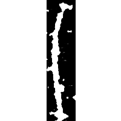
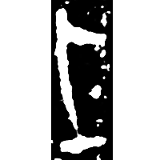
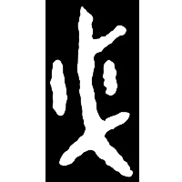
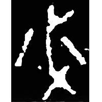
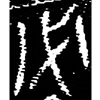
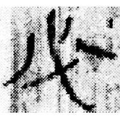
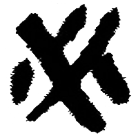
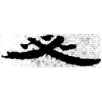
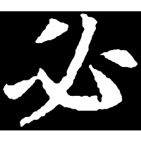
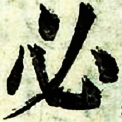

+++
radical = "61"
weight = 1
+++

| Shang (Bin) | Shang (Bin) | Shang (Wuming) | Late W.Zhou | Late W.Zhou | Zhanguo (Qin) | Qin | Qin | Han | Nanbei (N.Wei) | Nanbei (N.Wei) | Ming |
| ----- | ----- | ----- | ----- | ----- | ----- | ----- | ----- | ----- | ----- | ----- | ----- |
|  |  |  |  |  |  |  |  |  |  |  |  |
| 合4283 | 懷962 | 屯2170 [⿲木必木] | 集181.2 | 集10172 | 集12109 | 里耶8-138正 | 睡.日乙101 | 居新EPT40:202 | 彭城王妃墓誌 | 魏郭顯墓誌 | 字彙 |

{柲} \*prit "handle" ♪→ {必} \*pit "certainly"

Depiction of a handle. Later decorative lines were added.

- 裘錫圭 1980 - 釋“柲”
- 季旭昇 2014 - 說文新證 \[2nd ed.\] (87)
