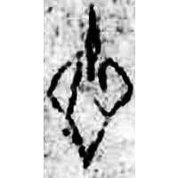
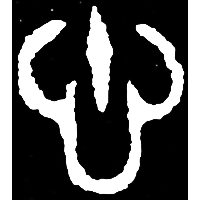
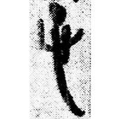
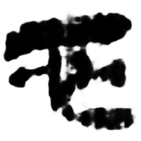
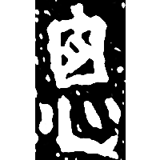
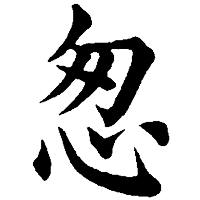
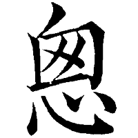

+++
radical = "61"
weight = 1
+++

| Shang (Bin) | Late W.Zhou | Qin | W.Han | W.Han | Sanguo (Wei) | Nanbei (Song) | Nanbei (N.Wei) | Nanbei (N.Wei) | Tang | Tang | Ming |
| ----- | ----- | ----- | ----- | ----- | ----- | ----- | ----- | ----- | ----- | ----- | ----- |
|  |  |  |  |  |  |  |  |  |  |  |  |
| 合5346 | 集4326 | 睡.日甲158反 | 北.淫39 [總] | 北.周34 [蔥] | 魏晉0032X [總] | 爨龍顔碑 [總] | 元寶建墓誌 [聰] | 南0291X [總] | 五經文字 [聰] | 干祿字書 [聰] | 字彙 |

{聰} \*tsʰˤoŋ "clever" ♪→ {悤(悤)} \*tsʰoŋ(tsʰoŋ) "quickly"

[心](https://panatesu.github.io/glyph-origins/radicals/61/#U%2b5FC3) *HEART* + unknown element (probably a shortened form of ♪[舂](https://panatesu.github.io/glyph-origins/radicals/134/#U%2b8202) \*STOŊ).

- 裘錫圭 1988 - 說字小記・說“悤”“聡”
- 季旭昇 2014 - 說文新證 \[2nd ed.\] (761-762)
